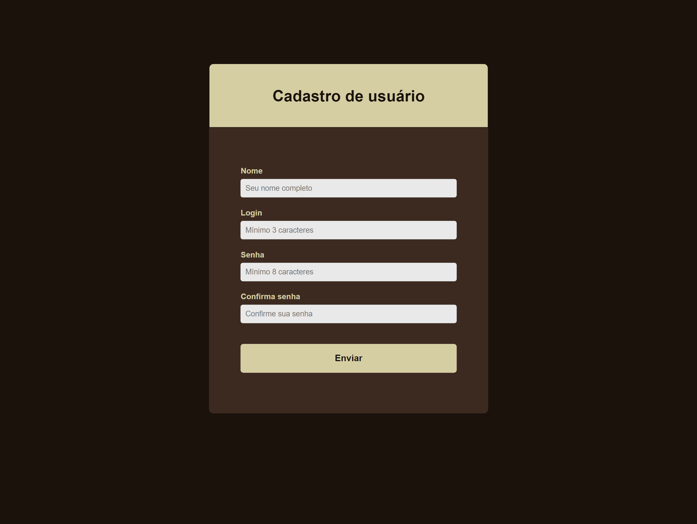

# Gerenciador de Empresas

Este projeto foi inicialmente criado como parte do curso 'Java Web: crie aplicações com Servlets e MVC' da Alura. As tecnologias utilizadas no projeto base eram Java 10, JSP e Javax Servlet. A ideia é desenvolver ainda mais essa aplicação colocando em prática minhas habilidades.

## Tecnologias utilizadas

- Java 17
- Maven
- Jakarta Servlet
- JSP
- JPA / Hibernate
- MySQL
- Bcrypt
- Json / Gson
- Lombok
- CSS
- Font Awesome
- JavaScript (Front-end)
- AJAX

## Principais Melhorias

- Reestruturação de pacotes.
- Boas práticas.
- Gerenciamento de dependências com Maven.
- Estilização com CSS.
- Relacionamento entre objetos.
- Persistência com banco de dados relacional utilizando JPA.
- Criptografia de senha.
- Javascript para o front-end.
- Requisições assíncronas com AJAX.
- Validação de entradas com Bean Validation
- Migração da biblioteca javax-servlet para jakarta-servlet.
- Adição de Dockerfile e script shell para implantação em um contêiner.
- Novas funções.

<br>

## Mudanças visuais e funcionais

### Header


- Header com links para navegação.
- Modal com o nome do usuário logado e botão de logout usando ícones Font Awesome.

---
### Interface de Login


#### Antes:


#### Depois:

<br>
---
### Cadastro de Usuários

<br>
- Caso o usuário não tenha conta, agora ele pode se cadastrar.
<br>
---

### Home

#### Antes

<br>
Os elementos são adicionados através de um banco fictício. A página inicial permite apenas editar ou remover por completo.

#### Depois

<br>
 


- Os objetos Empresa possuem relacionamento com Usuario, permitindo que uma página mostre todas as empresas cadastradas na plataforma e outra página mostre apenas as empresas do Usuário.
- O Usuário só pode editar e arquivar empresas relacionadas consigo
- O Usuário consegue criar uma nova Empresa.
- As remoções agora não são mais deletes, são exclusões lógicas, definidas por um atributo booleano chamado 'ativo', que determina se o status de cadastro de uma empresa é ativo sim ou não.
- Os botões arquivar/desarquivar quando clicados enviam uma requisição assíncrona para o servidor que altera o atributo 'ativo' da Empresa no banco de dados. Se a requisição for bem-sucedida, Empresa será ocultada e irá aparecer na outra aba, ou seja, se ela estava ativa, quando o botão 'Arquivar' é clicado, ela é ocultada da lista de Empresas ativas e poderá ser visualizada na aba 'Arquivados'.
- Empresas com 'ativo' false são listadas somente para o usuário vinculado a ela.

---

### Tratamento das entradas nos formulários client-side


- O formulário só será enviado quando todos os campos estiverem preenchidos corretamente. 
- Se o usuário inserir alguma informação que não esteja dentro do padrão que cada campo exige, surgirão mensagens de erro nos campos com problema.
- O campo 'login' é um atributo unico, não pode ser repetido no banco de dados. Quando o formulário é submetido é disparado um evento que faz uma requisição AJAX para verificar se o valor do campo login já está em uso, se a resposta for 'true' é exibida a mensagem de erro.

### Tratamento das entradas nos formulários  server-side

- Mesmo que o usuário consiga inserir entradas que estão em desacordo com as regras dos campos, são feitas validações com Bean Validation do lado do servidor.

- Foi criada uma anotação personalizada que valida se 'login' já existe no banco:

```
@Target(ElementType.FIELD)
@Retention(RetentionPolicy.RUNTIME)
@Constraint(validatedBy = LoginDisponivelValidator.class)
@Documented
public @interface LoginDisponivelAnnotation {

    String message() default "VALIDATION ERROR: Login já existe no banco de dados";

    Class<?>[] groups() default {};

    Class<? extends Payload>[] payload() default {};
}

@NoArgsConstructor
public class LoginDisponivelValidator implements ConstraintValidator<LoginDisponivelAnnotation, String> {

	private UsuarioRepository repository = new UsuarioRepositoryMySQL(JPAUtil.getEntityManager());
	
	public LoginDisponivelValidator(UsuarioRepository repository) {
		this.repository = repository;
	}
	
	@Override
	public void initialize(LoginDisponivelAnnotation constraintAnnotation) {
	}
	
	@Override
	public boolean isValid(String login, ConstraintValidatorContext context) {
		return !repository.existsByLogin(login);
	}

}
```

- Quando o usuário submete a requisição para criação de um novo usuário, cada campo capturado popula um DTO:

```
public record UsuarioDTO(
		@NotBlank(message = "VALIDATION ERROR: Nome não pode ser nulo")
		@Pattern(regexp = "^[A-Za-zÀ-ÖØ-öø-ÿ' _-]+$", message = "VALIDATION ERROR: Nome só permite letras, apóstrofo (\\') e hífen (-)")
		String nome,
		
		@NotBlank(message = "VALIDATION ERROR: Login não pode ser nulo")
		@Size(min = 3, message = "VALIDATION ERROR: Login precisa ter no mínimo 3 caracteres")
		@LoginDisponivelAnnotation(message = "VALIDATION ERROR: Login já existe no banco de dados")
		String login,
		
		@NotBlank(message = "VALIDATION ERROR: Senha não pode ser nulo")
		@Size(min = 8, message = "VALIDATION ERROR: Senha precisa ter no mínimo 8 caracteres")
		String senha,
		
		@NotBlank(message = "VALIDATION ERROR: Confirma não pode ser nulo")
		String confirma) {
	
		@AssertTrue(message = "VALIDATION ERROR: Confirma deve ser igual a senha")
		boolean isSenhaConfirmada() {
			return senha.equals(confirma);
		}
}
```

- Após são executadas as validações:

```
	protected void novoUsuario(HttpServletRequest request, HttpServletResponse response) throws IOException, ServletException {
		
		Validator validator = ValidatorUtil.getValidator();
		
		String nome = request.getParameter("nome");
		String login = request.getParameter("login");
		String senha = request.getParameter("senha");
		String confirma = request.getParameter("confirma");
		UsuarioDTO dto = new UsuarioDTO(nome, login, senha, confirma);
		
		//executa as validações
		Set<ConstraintViolation<UsuarioDTO>> violations = validator.validate(dto);
		
		//se houver violations
		if(!violations.isEmpty()) {
			for(ConstraintViolation<UsuarioDTO> violation : violations) {
				//imprime as mensagens de erro das validações
				System.out.println(violation.getMessage());
			}
			//redireciona o usuário para página de validationError
			response.sendRedirect(enderecoJSP("/error/validationError.html"));
			return;
		}
		
		//se passou nas validações, instancia a entidade Usuario e persiste
		repository.persist(new Usuario(dto));
		System.out.println("Usuario cadastrado!");
		response.sendRedirect(usuarioParamAcao("loginForm"));
	}
```

- Se não passar nas validações, o usuário é redirecionado para uma página de erro:


---

### Estilização dinâmica de botões

- Os botões 'Arquivar', 'Desarquivar', 'Arquivados' têm seu texto, ícone e estilo alterados dinâmicamente com JS.

## Como Executar

- Importe o projeto Maven
- Implante em um servidor Tomcat 10.1 com Java 17 ou superior
