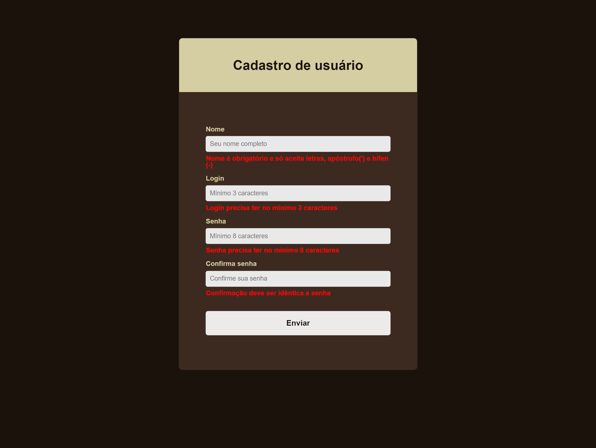

# Gerenciador de Empresas

A base desse projeto foi criada no curso [Java Web: crie aplicações com Servlets e MVC](https://cursos.alura.com.br/formacao-java-web) da [Alura](https://github.com/alura-cursos), a versão base se encontra na branch versao-original-alura.

Este é um projeto web com Java legado. É meu primeiro projeto web, nele tive a primeira vez de muitas coisas, por isso, preferi por não usar frameworks e libs no front-end, para conseguir resolver tudo da maneira mais crua. Esse projeto surgiu como um treinamento para praticar CSS e alguns conceitos de backend. A medida que fui desenvolvendo surgiram novas ideias e acabou tomando outra proporção. Com ele consolidei o entendimento de testes automatizados de unidade e integração, boas práticas e padrões de projeto, anotações personalizadas, validações client-side e server-side com lógica de programação e expressões regulares, tratamento de exceções, tratamento de respostas ao cliente, requisições AJAX, modularização no front-end, CSS e principalmente JS. JS era uma linguagem completamente desconhecida para mim, foi criando esse projeto que aprendi a programar em JS para o front do zero. 

## Tecnologias utilizadas

- Java 17
- Maven
- Jakarta Servlet
- Jakarta Validation
- JPA / Hibernate
- MySQL / H2 (test)
- Bcrypt
- Junit Jupiter
- Mockito
- Gson
- Lombok
- Expressões Regulares
- JSP
- CSS
- JavaScript (Front-end)

## Principais Melhorias

- Reestruturação de pacotes.
- Gerenciamento de dependências com Maven.
- Migração da biblioteca javax-servlet para jakarta-servlet.
- Relacionamento entre objetos.
- Persistência com banco de dados relacional com JPA.
- Criptografia de senha.
- Validação de entradas com Bean Validation.
- Testes automatizados de unidade.
- Testes automatizados de integração.
- Padrões de design: services, repositories e DTOs.
- Validação de formulários client-side.
- Paginação de consultas.
- Estilização com CSS.
- Páginas dinâmicas com JS e AJAX.
- Modularização do front-end.

## Novas funções
- Criar `Usuario`.
- Criar `Empresa`.
- Listar somente `Empresa` do `Usuario`.
- Listar somente `Empresa` ativa ou somente arquivada.
- Editar `Empresa` de forma dinâmica.
- Arquivar `Empresa` de forma dinâmica. 
- Pesquisar por registros `Empresa`.

---

## Login
- Antes de enviar o formulário para o servidor é verificado se os campos atendem às regras mínimas dos campos.

---

### Cadastro de `Usuario`
- Sempre que o formulário é submetido, é disparada uma requisição AJAX que verifica se o login digitado já existe.

---

### Lista `Empresas` do `Usuario` 
- Os objetos `Empresa` possuem relacionamento com `Usuario`.
- O `Usuario` só pode editar e arquivar empresas relacionadas consigo.
- As remoções são exclusões lógicas, definidas pelo atributo `ativo`.
- Os botões arquivar/desarquivar quando clicados enviam uma requisição assíncrona para o servidor que altera o atributo `ativo` da `Empresa` no banco de dados. Se a requisição for bem-sucedida, o elemento clicado será removido da view.

---

### Lista `Empresas`
- Somente empresas com `ativo == true` serão listadas.

---

### Pesquisa `Empresas`
- Caso nenhum registro seja encontrado, irá aparecer uma mensagem de erro como resultado da pesquisa.
- Somente empresas com atributo `ativo == true` serão recuperadas.

### Tratamento das entradas nos formulários  server-side

- Mesmo que o usuário consiga inserir entradas que estão em desacordo com as regras dos campos, são feitas validações com Bean Validation do lado do servidor.

## Considerações finais
Este projeto está finalizado e não irei mais implementar coisas novas nele, irei apenas fazer algumas refatorações. Consigo ver diversas melhorias que posso fazer, mas pretendo apenas melhorar o que já está pronto.

### Pontos fracos
- **Segurança:** merecia mais atenção, ficou de lado nesse projeto, mas o foco era entregar código back e front funcionando para o cliente.

- **CSS:** a escrita está complexa e acoplada, visivelmente um novato.

- **JS:** apesar de bem completo, a falta de libs/framework gerou uma complexidade desnecessária no código, tornando a manutenção amendrontadora. Também acredito que dava para desacoplar mais as funções e separar melhor as responsabilidades por arquivos.

- **Simplicidade:** o CRUD ficou muito simples, merecia mais funções e uma maior complexidade da entidade Empresa. Mas o foco estava mesmo em implementar código funcional.

- **Responsividade:** como eu estava iniciando, dispensei a responsividade para não aumentar a complexidade.

- **Separação de responsabilidades:** O controller EmpresaController com a responsabilidade de receber requisições json e requisições de apresentação me incomoda.

- **Ordenação:** esqueci.

### Destaque
- **Completude:** é um projeto bem completo, não ficou limitado a demonstrar uma única coisa. Nele você vai encontrar: implementação de persistência com JPA; arquitetura mvc com services e repositories; CRUD completo; criptografia de senha; validações server-side com Bean Validation e client-side com JS; anotações personalizadas; expressões regulares; DTOs e wrappers com Records; paginação end-to-end; tratamento de erros; desserialização de objeto Java para Json; classes Util para abstração de código repetitivo; testes automatizados de unidade e integração; tratamento de respostas ao cliente; requisições assíncronas com AJAX; JSP; HTML; CSS; JS; modularização do front, interface dinâmica. Em vez de um micro-projeto abordando uma simulação de um caso de teste, um caso de validação, um caso de arquitetura e etc, aqui temos uma aplicação completa, funcional e com diversos conceitos implementados na prática.

