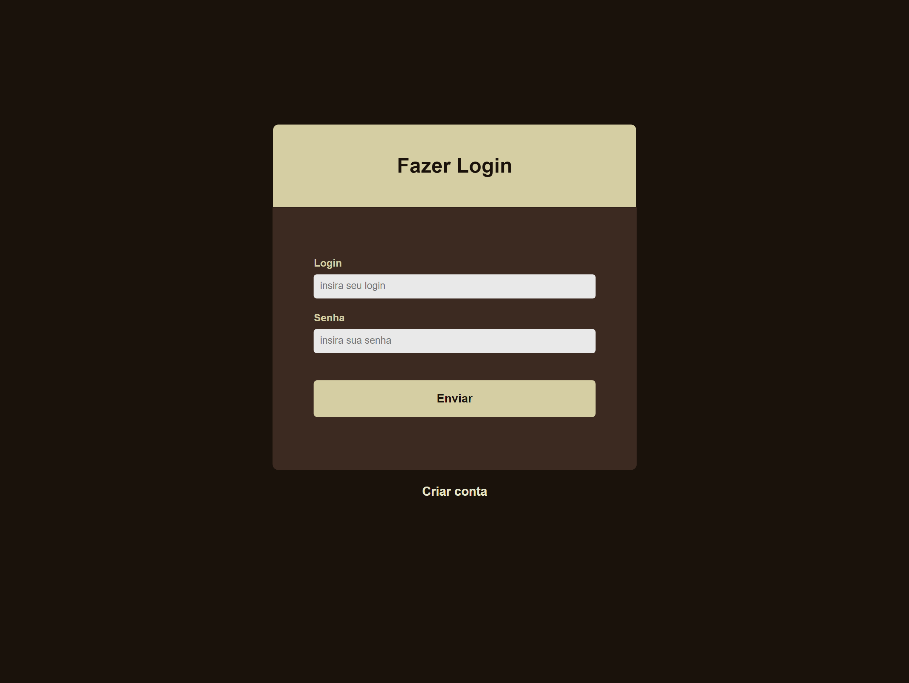
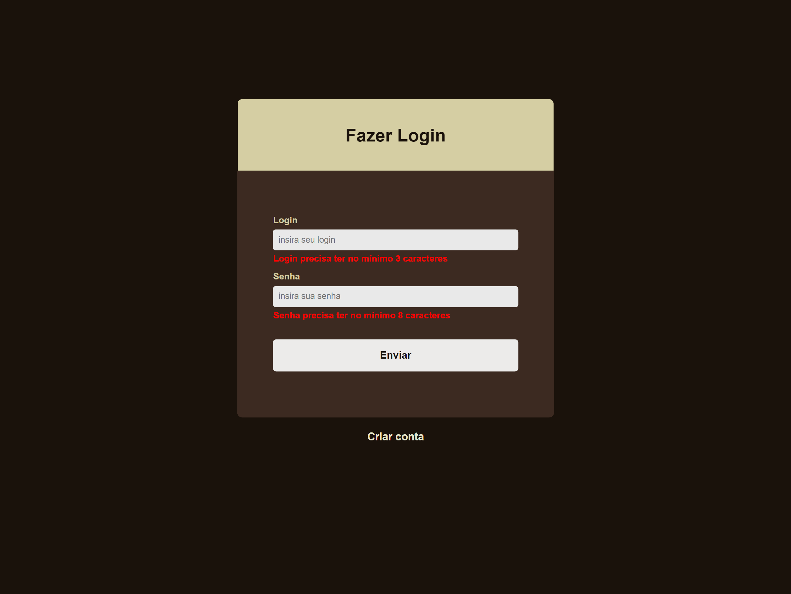
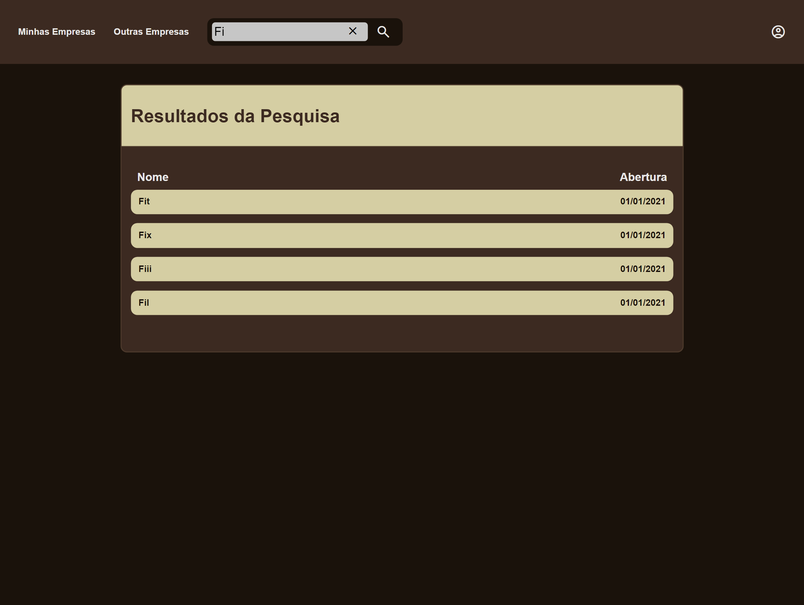

# Gerenciador de Empresas

A base desse projeto foi criada no curso [Java Web: crie aplicações com Servlets e MVC](https://cursos.alura.com.br/formacao-java-web) da [Alura](https://github.com/alura-cursos), a versão base se encontra na branch versao-original-alura.

Esse é meu primeiro projeto web, nele tive a primeira vez de muitas coisas, por isso preferi por não usar frameworks, para conseguir resolver tudo da maneira mais crua. Esse projeto surgiu como um treinamento para praticar CSS e alguns conceitos de backend. A medida que fui desenvolvendo surgiram novas ideias e acabou tomando outra proporção. Com ele aumentei meu entendimento de testes automatizados, boas práticas, CSS e principalmente JS. JS era uma linguagem completamente desconhecida para mim, foi criando esse projeto que aprendi a programar em JS para o front do zero.

## Tecnologias utilizadas

- Java 17
- Maven
- Jakarta Servlet
- Jakarta Validation
- JSP
- Bcrypt
- JPA / Hibernate
- MySQL / H2 (test)
- Mockito
- Junit Jupiter
- Gson
- Lombok
- CSS
- JavaScript (Front-end)

## Principais Melhorias

- Reestruturação de pacotes.
- Gerenciamento de dependências com Maven.
- Migração da biblioteca javax-servlet para jakarta-servlet.
- Relacionamento entre objetos.
- Persistência com banco de dados relacional com JPA.
- Criptografia de senha.
- Validação de entradas com Bean Validation.
- Testes automatizados de unidade.
- Testes automatizados de integração.
- Boas práticas.
- Estilização com CSS.
- Páginas dinâmicas com JS e AJAX.
- Validação de formulários client-side.
- Paginação de consultas.
- Modularização do front-end.

## Novas funções
- Criar `Usuario`.
- Criar `Empresa`.
- Listar somente `Empresa` do `Usuario`.
- Listar somente `Empresa` ativa ou somente arquivada.
- Editar `Empresa` de forma dinâmica.
- Arquivar `Empresa` de forma dinâmica. 
- Pesquisar por registros `Empresa`.

---

## Login
- Antes de enviar o formulário para o servidor é verificado se os campos atendem às regras mínimas dos campos.

---

### Cadastro de `Usuario`
- Sempre que o formulário é submetido, é disparada uma requisição AJAX que verifica se o login digitado já existe.

---

### Lista `Empresas` do `Usuario` 
- Os objetos `Empresa` possuem relacionamento com `Usuario`.
- O `Usuario` só pode editar e arquivar empresas relacionadas consigo.
- As remoções são exclusões lógicas, definidas pelo atributo `ativo`.
- Os botões arquivar/desarquivar quando clicados enviam uma requisição assíncrona para o servidor que altera o atributo `ativo` da `Empresa` no banco de dados. Se a requisição for bem-sucedida, o elemento clicado será removido da view.

---

### Lista `Empresas`
- Somente empresas com `ativo == true` serão listadas.

---

### Pesquisa `Empresas`
- Caso nenhum registro seja encontrado, irá aparecer uma mensagem de erro como resultado da pesquisa.
- Somente empresas com atributo `ativo == true` serão recuperadas.

### Tratamento das entradas nos formulários  server-side

- Mesmo que o usuário consiga inserir entradas que estão em desacordo com as regras dos campos, são feitas validações com Bean Validation do lado do servidor. Caso não passe na validação do servidor, será redirecionado para a página de validationError:

